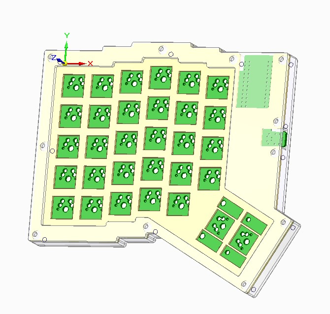

# g-split
A 60%(ish) split keeb (Still waiting on a good name)

Current status: Procrastination
- [x] PCB design
- [x] Case design
- [ ] PCB test fit with 3D printed parts
- [ ] Final case design 

CAD stuff done with with [Solid Edge](https://solidedge.siemens.com/en/) and [KiCad](https://www.kicad.org/) (+ other random utilities for hacky workarounds)
